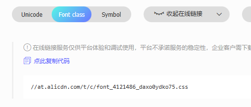

# uniapp-vue3-ts

##### uniapp-vue3-ts 脚手架

### 初始化

```
yarn install
npm install -g typescript
npm install -g ts-node
```

#### 或者 运行 根目录下 bin/install.bat 文件（双击即可） 不建议

### 启动

```
yarn start
```

### H5启动

```
// package.json 的 start和start:w 命令为
//  "start": "yarn file off && yarn run dev:h5"
//  "start:w": "start yarn file off --watch && yarn run dev:h5"
yarn start
```

#### 或者 运行 根目录下 bin/dev.bat 文件（双击即可）推荐在 ide 中 通过终端执行命令

### 打包（看 package.json 命令）

```
yarn build
```

### 开发建议

本项目使用的是 vue3 + vite + ts 开发，建议使用 vscode 开发，可以使用目前配置的一些类型，

1. to 开头为跳转函数，统一封装在 **src/utils/global/toPage.ts** 文件中
2. 字符转换工具 统一封装在 **src/utils/global/index.ts** 文件中
3. 接口 统一封装在 **src/service** 文件中
4. 快捷生成图标命令
   ```
   yarn iconfont-cli
   font_class_url: [url]
   ```
   url 在下方复制 \
   

